## Northwestern University

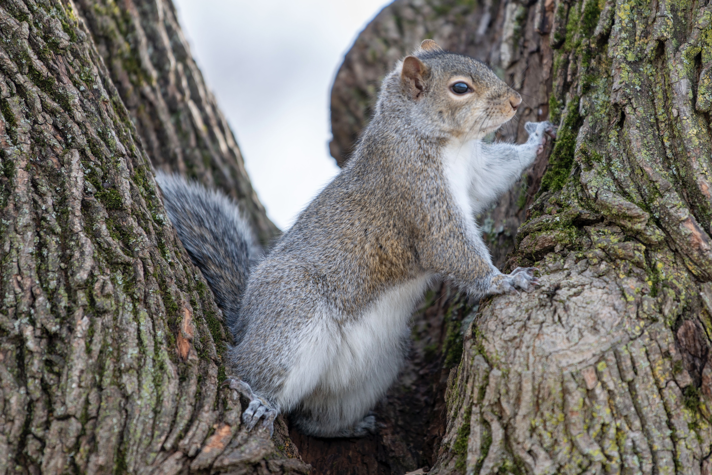

 
## Upper Penisula

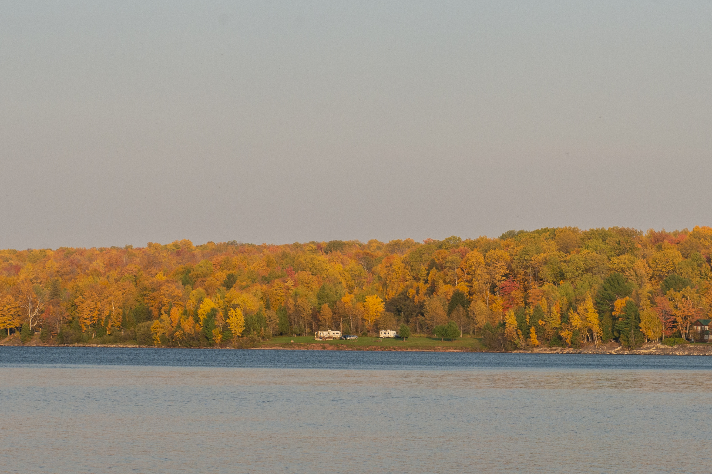

 
## [Mt.siguniang 四姑娘山](https://zh.wikipedia.org/wiki/%E5%9B%9B%E5%A7%91%E5%A8%98%E5%B1%B1)

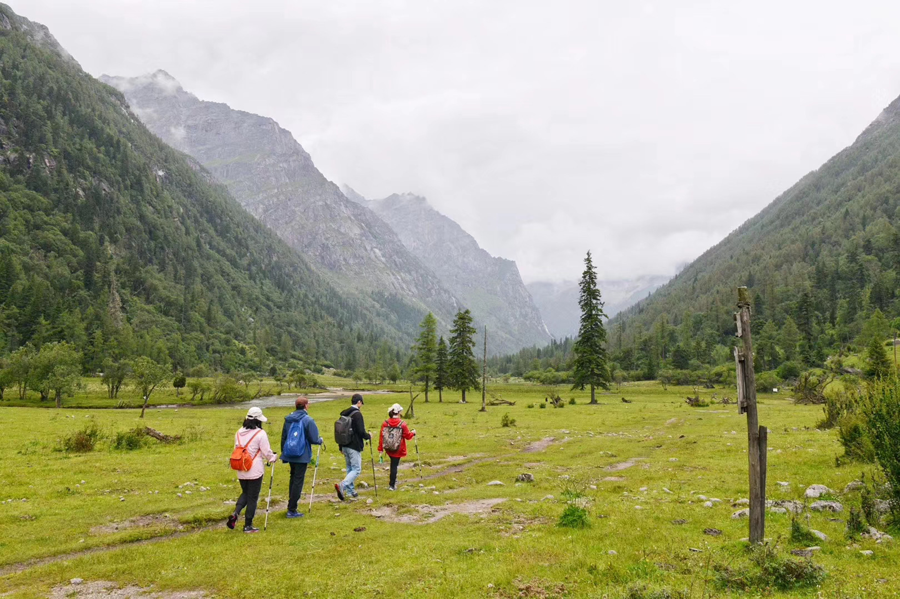

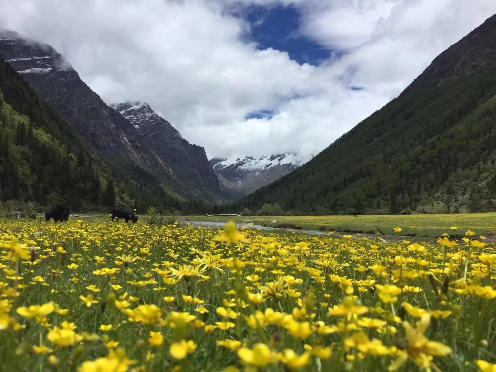

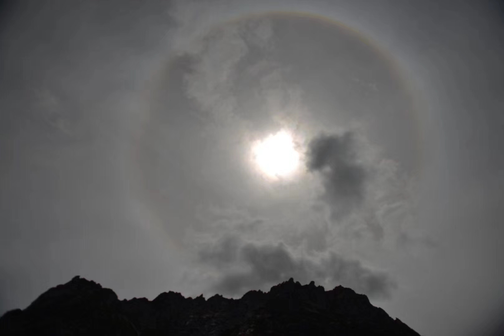

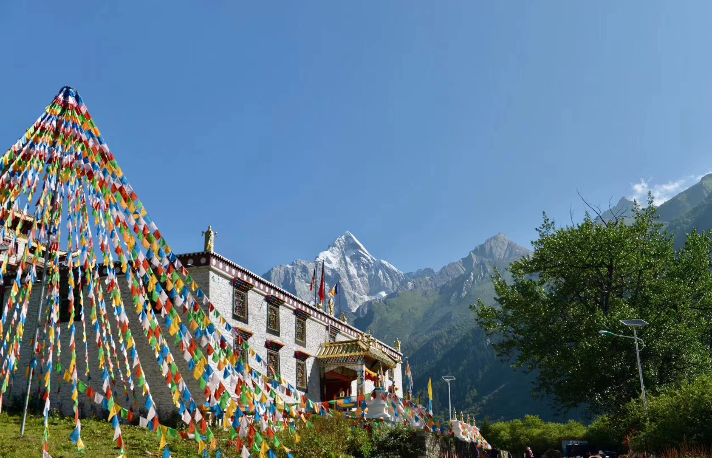
 
## [Gansu 甘肃](https://zh.wikipedia.org/wiki/%E7%94%98%E8%82%83%E7%9C%81)

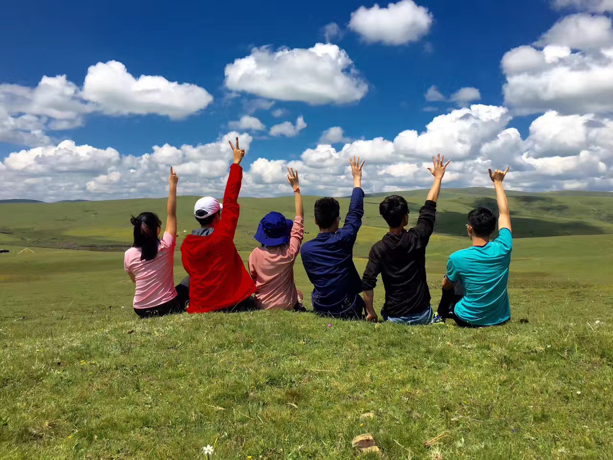

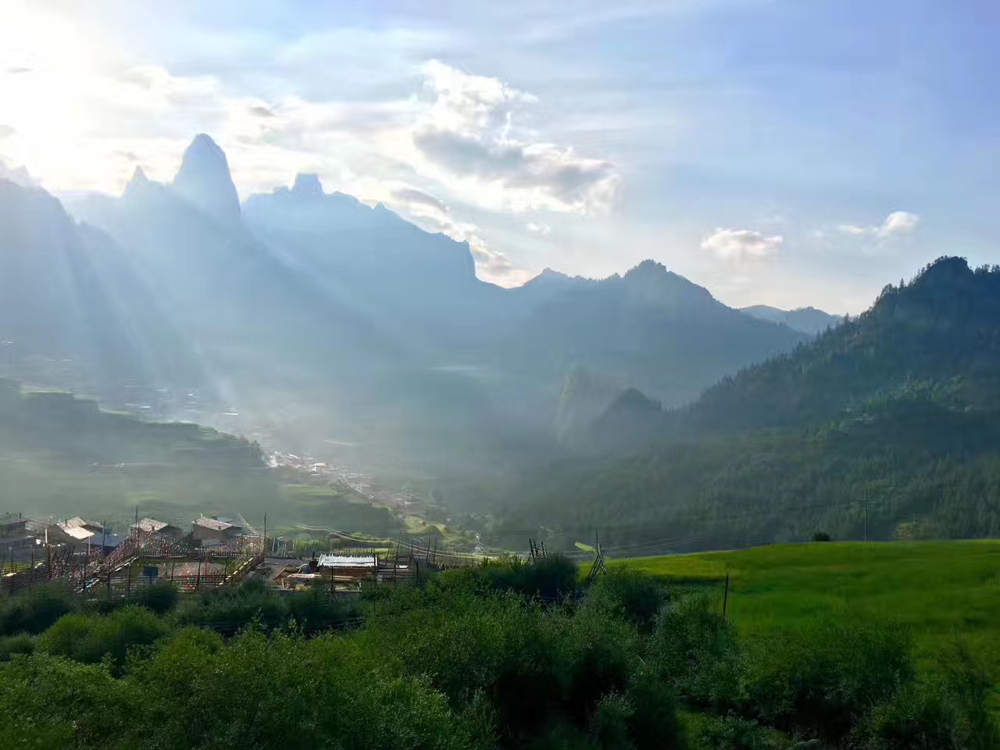

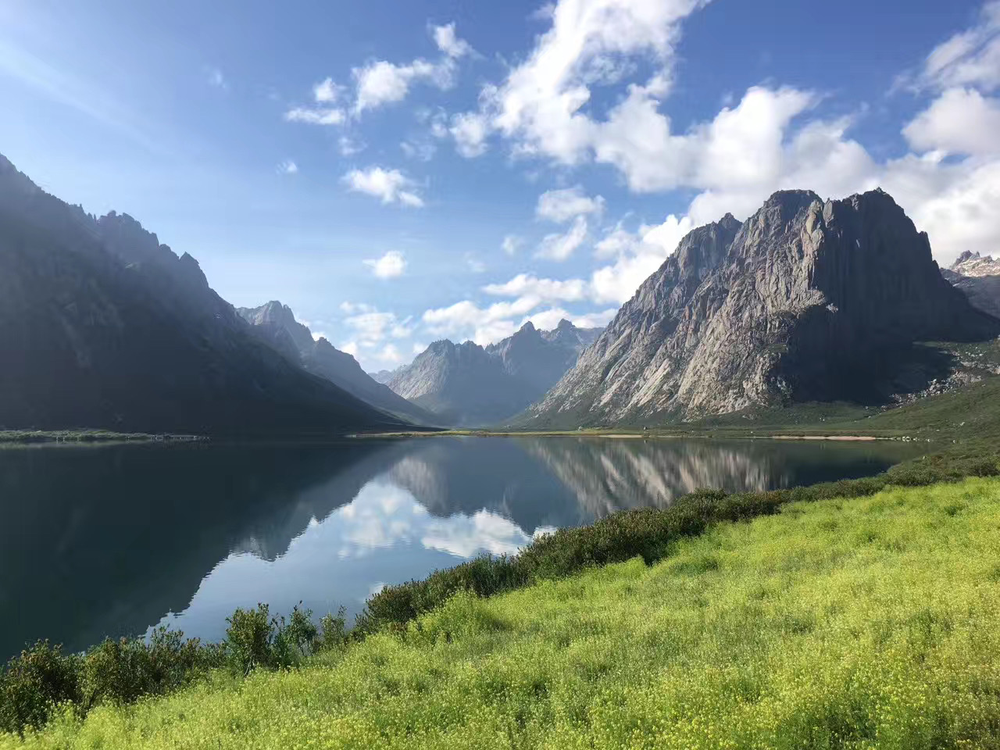
 
## [Tibet 西藏](https://en.wikipedia.org/wiki/Tibet_Autonomous_Region)

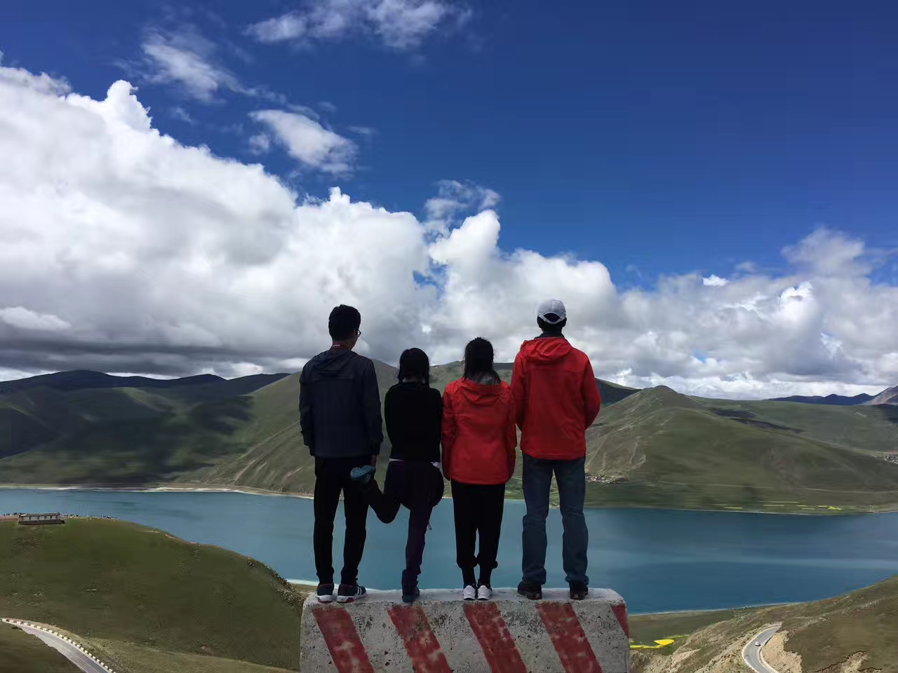
 
## [Xinjiang 新疆](https://en.wikipedia.org/wiki/Xinjiang)

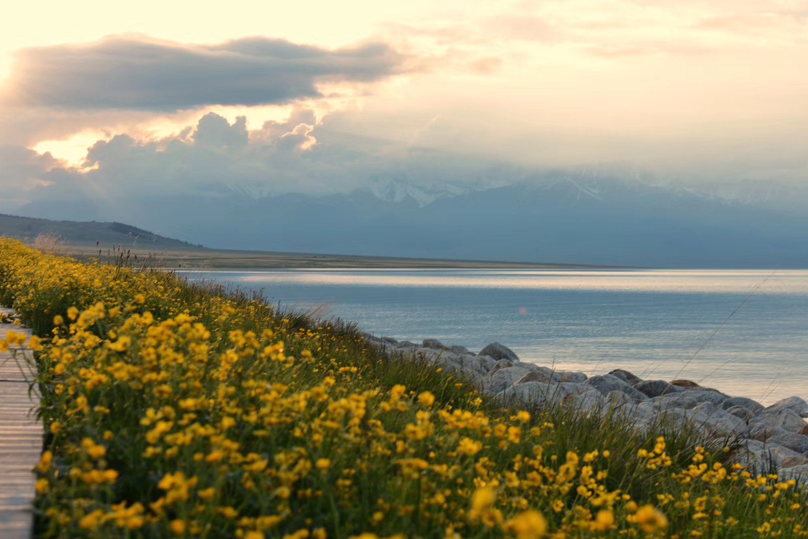

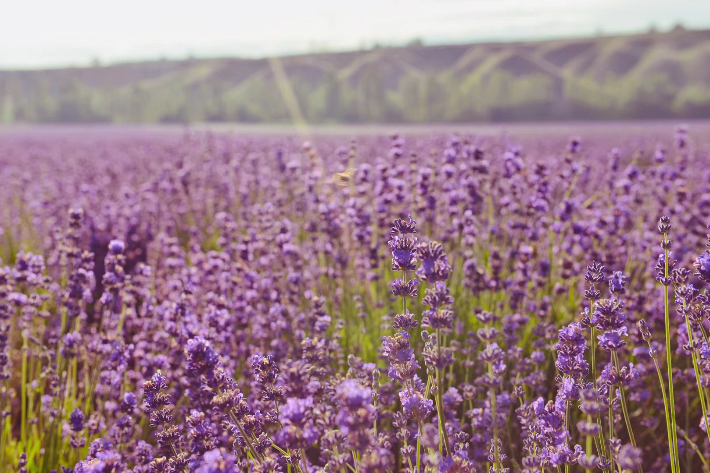

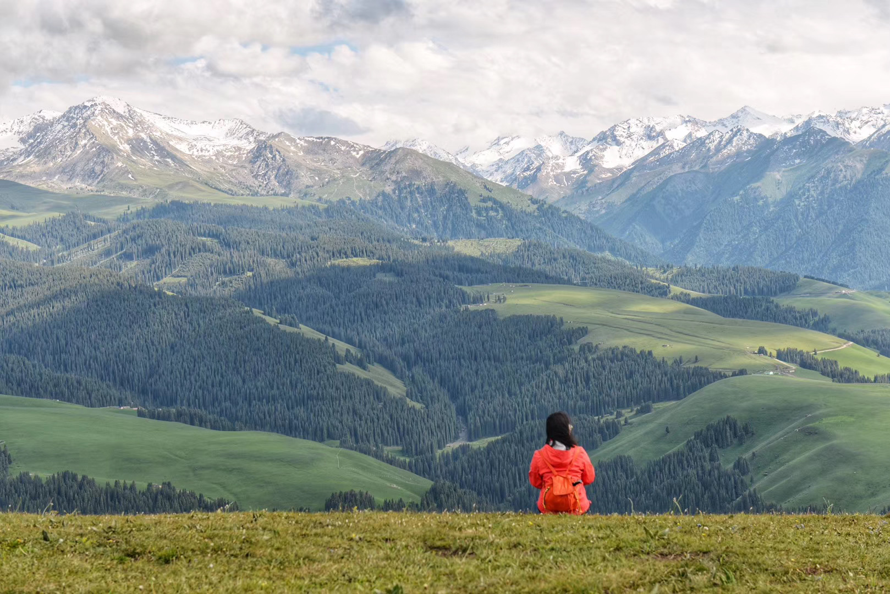

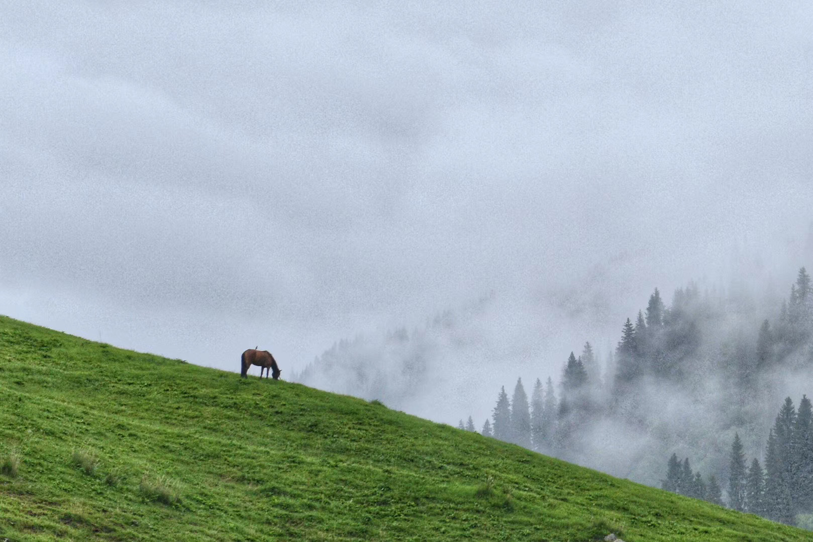

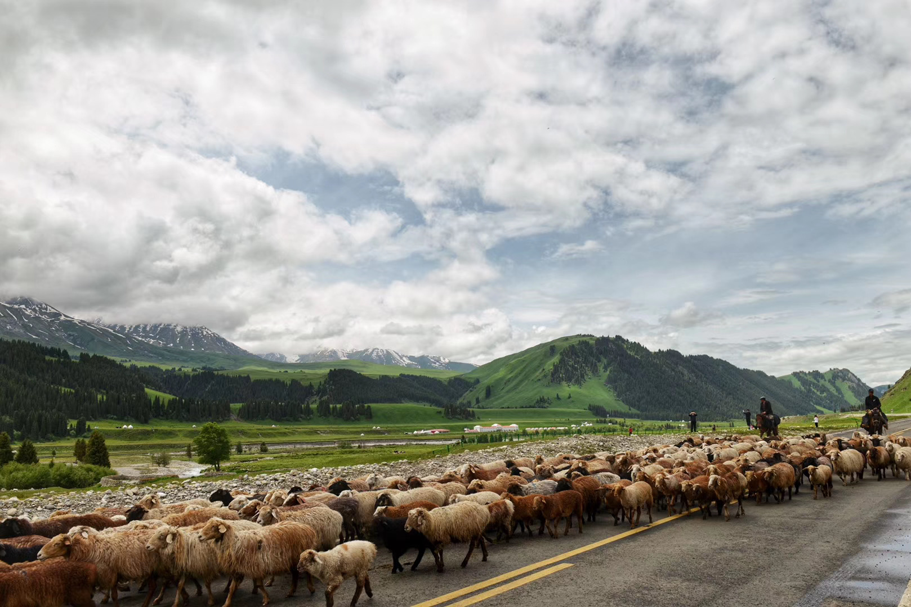

